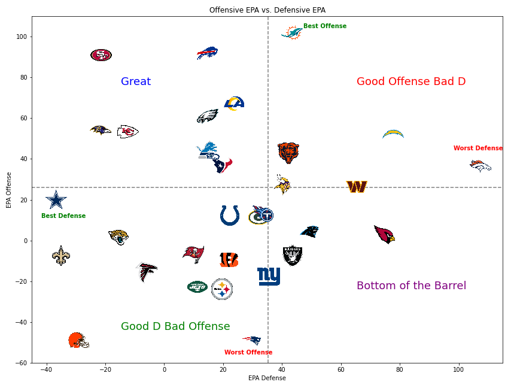

# NFL_Stats_2023_adv

# NFL Data Analysis and Predictive Modeling

This repository provides a set of tools for analyzing NFL data, creating informative graphs for specific player positions, and generating weekly predictions using advanced analytics.

## Features

- **Data Collection**: Collect NFL data, including player statistics, team performance, and game-related information.

- **Data Analysis**: Perform in-depth analysis of NFL data, focusing on specific player positions to gain insights into their performance.

- **Graphs and Visualizations**: The repository offers tools to create informative graphs and visualizations that help us understand how different teams and players are performing in the NFL.

- **Machine Learning Predictions**: I leverage advanced analytics, including statistics like EPA (Expected Points Added), to develop machine learning models. These models provide weekly predictions for each game, offering valuable insights for NFL enthusiasts, fantasy football players, and analysts.

- ## Visualizing Team Stats Based on EPA (Expected Points Added)

### Offensive EPA vs Defensive EPA

- ## What is EPA: Calculation:
- The EPA calculation provides a numerical value representing how much a play contributes to the team's scoring potential. A positive EPA indicates that the play had a positive impact on the team's scoring chances, while a negative EPA suggests a detrimental effect.

- Interpretation: A higher EPA value means that a play significantly improved the team's chances of scoring, while a lower (or negative) EPA value implies a decrease in scoring potential.
- The higher the EPA for Offense, the better.
- THe lower the EPA for Defense, the better.

In this graph, I measure a teams Offensive Efficiency Vs. a Defensive Effeciency based on total EPA both.